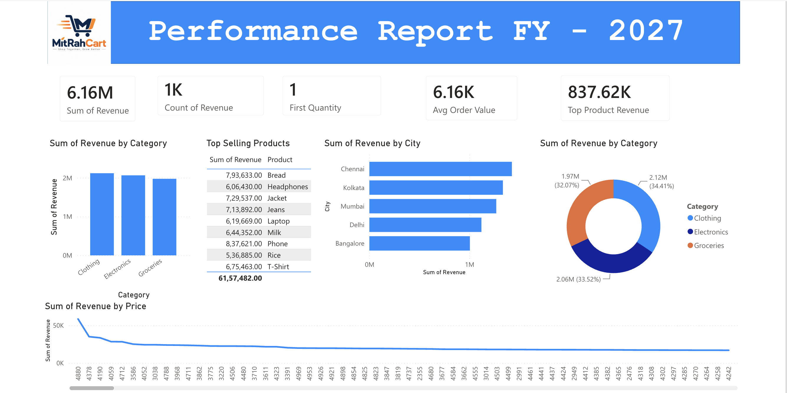

# 🛒 MitRah Cart – Performance Report FY 2027


## 📊 Project Overview

**MitRah Cart Performance Report** is a Business Intelligence dashboard designed to analyze and visualize the sales performance of MitRah Cart for **FY 2027**.

The dashboard provides a consolidated view of revenue performance across different **product categories, cities, products, and price points**, helping identify key business trends and high-performing areas.

The report transforms raw sales data into meaningful visual insights that can support better business and strategic decision-making.

---

## 🎯 Objectives

The main objectives of this project are:

- Analyze overall revenue performance.
- Identify the highest-performing product categories.
- Find the top-selling products based on revenue.
- Compare revenue performance across different cities.
- Analyze revenue distribution across categories.
- Understand the relationship between product prices and revenue.
- Provide an easy-to-understand business performance dashboard.

---

## 📈 Key Performance Indicators

The dashboard highlights the following major KPIs:

| KPI | Value |
|---|---:|
| 💰 Total Revenue | **6.16M** |
| 📦 Revenue Records | **1K** |
| 🛍️ Average Order Value | **6.16K** |
| 🏆 Top Product Revenue | **837.62K** |
| 🔢 First Quantity | **1** |

---

## 🗂️ Dashboard Analysis

### 1. Revenue by Category

The dashboard compares revenue generated by the three major categories:

- 👕 Clothing
- 💻 Electronics
- 🛒 Groceries

**Clothing** contributes the highest share of revenue, followed by **Electronics** and **Groceries**.

---

### 2. Top Selling Products

The report identifies the highest-revenue products.

Some of the top-performing products include:

| Product | Revenue |
|---|---:|
| 📱 Phone | 837,621 |
| 🍞 Bread | 793,633 |
| 🧥 Jacket | 729,537 |
| 👖 Jeans | 713,892 |
| 👕 T-Shirt | 675,463 |
| 🥛 Milk | 644,352 |
| 🎧 Headphones | 606,430 |
| 🍚 Rice | 536,885 |

> **Phone** is the highest-revenue product in the displayed product analysis.

---

### 3. Revenue by City

The dashboard compares revenue generated across major cities:

- Chennai
- Kolkata
- Mumbai
- Delhi
- Bangalore

**Chennai** records the highest revenue among the displayed cities, followed by Kolkata and Mumbai.

---

### 4. Revenue Distribution by Category

The category distribution shows:

| Category | Revenue | Share |
|---|---:|---:|
| 👕 Clothing | 2.12M | 34.41% |
| 💻 Electronics | 2.06M | 33.52% |
| 🛒 Groceries | 1.97M | 32.07% |

The revenue distribution is relatively balanced across all three categories, with **Clothing having the largest contribution**.

---

### 5. Revenue by Price

The price analysis visualizes how total revenue varies across different product price points.

This helps identify:

- High-revenue price ranges
- Revenue concentration
- Pricing patterns
- Potential pricing opportunities

---

## 🖥️ Dashboard Preview



> Add the dashboard screenshot to the root directory of this repository and rename it to `dashboard.png`.

---

## 🛠️ Tools & Technologies

This project focuses on **Business Intelligence and Data Visualization**.

Possible technologies used in the project include:

- 📊 Power BI
- 🗄️ SQL / MySQL
- 📈 Data Visualization
- 🔍 Data Analysis
- 📑 Business Intelligence

---

## 💡 Key Business Insights

Based on the dashboard:

1. **Total revenue is approximately 6.16M**, indicating strong overall sales performance.
2. **Clothing generates the highest category revenue** with approximately 34.41% of total revenue.
3. **Electronics contributes approximately 33.52%** of revenue.
4. **Groceries contributes approximately 32.07%**, showing that revenue is distributed relatively evenly across categories.
5. **Phone is the highest-revenue product** in the displayed product analysis with approximately 837.62K revenue.
6. **Chennai is the strongest-performing city** among the cities shown in the report.
7. The relatively balanced category contribution suggests that MitRah Cart is **not heavily dependent on a single product category**.

---

## 📁 Project Structure

```text
MitRah-Cart-Performance-Report/
│
├── 📊 MitRah Cart Performance Report.pbix
├── 🖼️ dashboard.png
├── 📄 README.md
